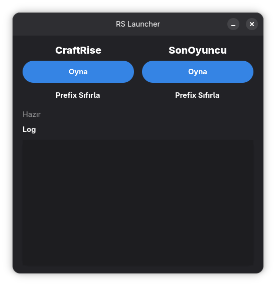

# RS Launcher

Craftrise ve Sonoyuncu için basit ve hızlı bir proton başlatıcısı.



## Kurulum
1. Depoyu klonlayın:  
   ```bash
   git clone https://github.com/Mercimekcik/rs-launcher.git
2. Klasöre girin:
   ```bash
   cd rs-launcher
3. Programı Python ile çalıştırın:
   ```bash
   python3 main.py

## Sorunlar

Bazen Java indirirken takılabiliyor.

Çözüm: “Continue” diyip birkaç dakika bekleyin, gerekirse programı/oyunu kapatıp tekrar açın.
